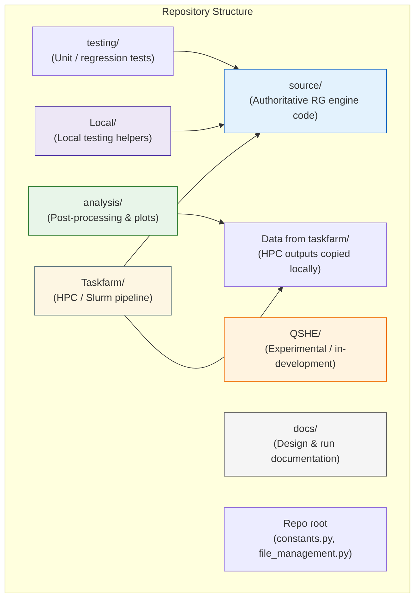

# RG Monte Carlo pipeline

This repository contains a Slurm-focused research pipeline for large-scale renormalisation-group (RG) Monte Carlo runs. It runs generation tasks as Slurm array jobs, aggregates per-batch histograms, applies laundering/resampling and optional symmetrisation, then iterates RG steps for FP (fixed-point) and EXP (shifted/exponent) workflows.

Important: this project is staged onto the cluster — the full git checkout is not expected to exist on the remote host. See the **Deployment / staging model** in `docs/Repo-Structure.md` and `docs/Pipeline.md` for authoritative remote paths.

---

### Folder responsibilities (high-level)

- **Taskfarm/**
  Slurm-facing orchestration layer. Contains job scripts and glue code used on the HPC cluster.
  This is the *authoritative execution environment* for large-scale RG runs, sent to <REMOTE_ROOT> via `file_management.py`

- **source/**
  Authoritative Python implementation of the RG engine.
  All execution modes (HPC or local) ultimately call into this code.

- **Local/**
  Non-authoritative helpers for small-N local testing and debugging.
  Carries out a self-contained RG flow without batching or aggregation ops.

- **analysis/**
  Post-processing only: plotting, statistics, ν extraction, etc.
  Does **not** participate in RG execution.

- **Data from taskfarm/**
  Read-only outputs copied back from the HPC cluster (histograms, configs, logs).

- **QSHE/**
  Experimental / exploratory code for the QSHE matrix (not part of the production pipeline).

- **docs/**
  Design documentation, runbooks, and troubleshooting notes.

- **testing/**
  Test files investigating solver behaviour.

- **Repo root files**
  Shared utilities and configuration helpers used across execution modes.

---

**Workflow overview**
```text
LOCAL (<LOCAL_REPO_ROOT>)            file_management.py                   CLUSTER (<REMOTE_ROOT>)
-------------------------           --------------------                 -------------------------
source/                    ───────▶  --push code        ───────────────▶  code/source/
Taskfarm/scripts/          ───────▶  --push scripts     ───────────────▶  scripts/
Taskfarm/configs/          ───────▶  --push config      ───────────────▶  scripts/

job_outputs/               ◀───────  --action pull ...  ◀───────────────  job_outputs/<version>/<FP|EXP>/
```

See the `docs/` folder for developer and operator guidance: `docs/Pipeline.md`, `docs/Runbook.md`, `docs/Artifacts.md`, `docs/Config.md`, `docs/Local-Testing.md`, `docs/Repo-Structure.md`, `docs/Troubleshooting.md`.

---

**Key facts extracted from `file_management.py` (authoritative mapping)**

- Push code: local `source/` is uploaded to remote `<REMOTE_ROOT>/code/` so runtime Python will be available at `<REMOTE_ROOT>/code/source/`.
- Push scripts/configs: local `Taskfarm/scripts/*.sh` and `Taskfarm/configs/*` are uploaded to `<REMOTE_ROOT>/scripts/`.
- Pull outputs: outputs are pulled from `<REMOTE_ROOT>/job_outputs/{version}/{FP|EXP}/...` into local data folders created by `file_management.py`.
- Transfer method: `scp -r` for Windows (`--sys windows`) and `rsync -avz --partial --progress` for Linux/Mac (`--sys linux`/`mac`).

Placeholders used throughout these docs:

- `<LOCAL_REPO_ROOT>` — your local repository root (where you run `python -m Local.run_local`, edit code, etc.)
- `<REMOTE_ROOT>` — remote base directory (this corresponds to `${remote_dir}` used by `file_management.py`) on `<HOST>`.
- `<HOST>` — remote host (this corresponds to `${host}` read by `file_management.py`).

Quick local sanity check (same as in `docs/Local-Testing.md`)

```bash
python -m Local.run_local --config Local/configs/local_iqhe --set "rg_settings.steps=2" --set "rg_settings.samples=10000" --type FP
```

---

# Environment vars (.env)

This project requires certain environment variables to be defined for usage by `constants.py` and `file_management.py`

These will be loaded from a `.env` file from the project root and will be required for file transfers and local runs.

Required env vars:
- DATA_DIR: Path to folder for data transfer from Remote server -> Local. Used for analysis of slurm generated data files. (used by `file_management.py`)
- LOCAL_DIR: Path to folder containing locally produced data (used by `file_management.py`)
- ROOT_DIR: Project root of local repo (used by `file_management.py`)
- TASKFARM_DIR: Path to Taskfarm folder (used by `file_management.py`)
- HOST: ssh hostname. Assumes pre-existing config file under local .ssh folder. (used by `file_management.py`)
- REMOTE_DIR: Path to remote project root (used by `file_management.py`)

---

File transfer workflow (examples invoking `file_management.py` from `<LOCAL_REPO_ROOT>`):

```bash
# Push Python code (uploads local `source/` to remote <REMOTE_ROOT>/code/source/)
python file_management.py --push code --version fp_iqhe_numerical_shaw --sys linux

# Push scripts and configs (uploads Taskfarm scripts and configs into <REMOTE_ROOT>/scripts/)
python file_management.py --push scripts --push config --version fp_iqhe_numerical_shaw --sys linux

# Pull outputs (pulls 'hist' or other directories from <REMOTE_ROOT>/job_outputs/{version}/{FP|EXP}/... into your local data dirs)
python file_management.py --action pull --pull hist --version fp_iqhe_numerical_shaw --type FP --sys linux
```

Notes: `file_management.py` is the ground truth for remote layout and transfer behaviour — edit it if you need alternate transfer semantics.

---

General workflow for edits:

- Changes to source/, Taskfarm/scripts or Taskfarm/configs should be made locally.
- Push changes via file_management.py with the required commands to facilitate transfer to the remote server
- Updated scripts can then be submitted on the remote server

---

Notes:

- Local usage relies on vars defined in `constants.py`
- `constants.py` uses `load_dotenv()` to load vars from a `.env` file
- To enable local testing, create your own .env file with the required env vars ( see docs/Local-Testing.md for an in-depth walkthrough )
- source is not meant to be installed as a package; it will be imported directly on the cluster.

---

For full details see the `docs/` folder.

